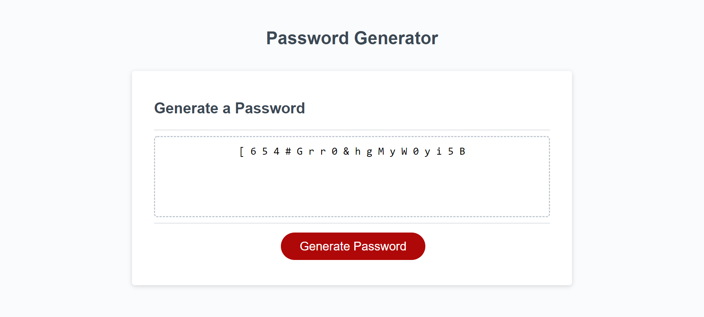

# password-maker
Password Generator

This project uses javascript to make a dynamic website that creates a randomly generated password for the user. The app can be used to create a secure password using letter (upper and/or lower case), numbers, and special characters. It makes extensive use of loops and arrays to log randomly generated characters and return them to the user. 

HOW THE PROGRAM WORKS

To create a password, the user first needs to click on the generate password button. This will trigger a series of alerts that collect information on the type of characters the user would like to have in their password and its desired length. When the user does not chose any type of character for the password, the program alerts them to choose a character type and gives them the options again. If the user chooses a password length that is shorter than 8 characters or longer than 128 characters, then the program tells the user to pick a number between those two parameters in the text area, and the user will have to start over. Once the user enters all their parameters, the program runs, and a password appears in the text area on the page.

The password is created by randomly choosing  letters, numbers, or special characters that are then added to a visable array in the text area. The process can be a little confusing due to the multiple layers of randomization, but I will do my best to lay it out clearly. Initially, all the possible characters are put into arrays based on their classification (ie upper case letter, lower case letter, and special character). You will notice there is not a number array because we can pick a number at random using an equation. After the user enters the length (x) of the desired password, this information is also used to run a loop for that (x) many times. 

Each time the loop runs, it picks a random number for each character type (upper, lower, ect.) specified by the user. This random number is then used as an index number to pull a character from the corresponding array. It then takes this character and adds it to a different "answers" array for each character (upperAnswers, lowerAnswers, ect.). The position of each random character within the answers array is determined by the loop on which it was chosen. For numbers, we don't have to pull from an array. We just use an equation to pick a random number, and it is added to the numberAnswers array with the index position based on its loop number.

 At this point we have randomly chosen a number, used it as an index number to pull a character from an array, and used the loop number on which this happened as an index number to assign the random character to an answer array. 

Each of the answers arrays are then added to an "allAnswers array". Once there is an allAnswers array, the program must now randomly choose characters from within the arrays contained in the allAnswers array. To do this I had to set two more variables (randNumb1, randNumb2) that are randomly generated numbers. The first, randNumb1 is used to choose an index number within the allAnswers array. After an array is chosen, randNumb2 chooses a character in the nested array. For example, if allAnswers = ["upperAnswer", lowerAnswers], randNumb1 = 1, and randNumb2 = 2, the program would select lowerAnswers first (since its index number is 1). It would then choose the character within lowerAnswers with the index number of 2. These randomly generated answers are added to a finalAnswer array. Again, the index number of each answer corresponds to the loop number on which it was generated.
 
 As a recap, we have now taken our answer arrays and added them to a parent "allAnswers" array. We then choose two random numbers to retrieve characters from the allanswers/"character"answers arrays. These characters are assigned to the "finalAnswers" array. 

Our finalAnswers array now contains the random password, but it is sepperated by ","s. We join the array with a " " in between characters to make it more readable. The password is then returned to the user in the text area. The final outcome should look like the screen below. Each character in the password has actually been randomly chosen 3 seperate times, and the chances of guessing an 8 digit password on the first try are over 1 in 
58,000,000,000,000,000,000,000.

GENERAL COMMENTS ON THE PROJECT

This was my first project that incorporated a script file. It was challenging at first, but with dilligence, I was able to overcome any issues that arose. After initially launching the app, I had a few bugs that had to be worked out. Many times, the password would not be the length that was specified by the user prompt. I discovered that I was getting a number of undefined responses in my answer arrays. To fix this, I had to add if conditionals and rework a couple of my equations to make sure non of my randomly generated numbers would be below 0. I also had an issue with the program not running correctly after a number outside of the 8-128 character range had been entered in the password lenght prompt. To resolve the length issue, I added a conditional that will stop the script if the number falls outside the range and convey to the user that they must enter a number between 8 & 128. 

LINKS:

Here are the links to the deployed website and the github repository for the project:

Deployed site:
https://ejsmith13.github.io/password-maker/

Repository:
https://github.com/ejsmith13/password-maker

Here is a screenshot of the deployed web-app after a password has been generated.

2020 ejsmith13  Confidential and Proprietary. All Rights Reserved.